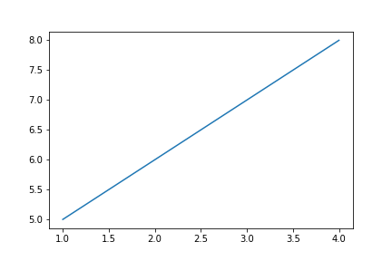
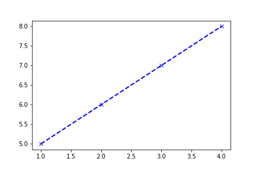
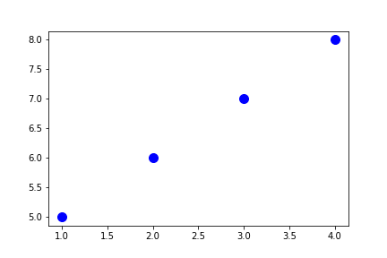
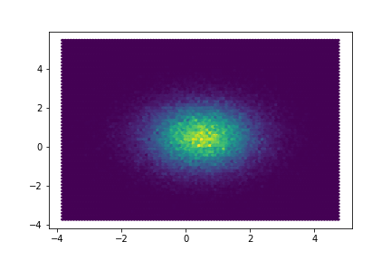
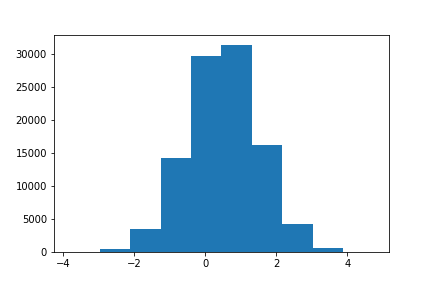

# Computing in Astronomy<!-- .element: class="centered" -->
### Matthew Turk<!-- .element: class="righted" -->
### Spring 2018<!-- .element: class="righted" -->
### Lecture 4 <!-- .element: class="righted" -->

---

## Python for Science (2)

 * ~~Arrays~~
 * ~~Loops, functions, and scripts~~
 * Matplotlib
 * `ipywidgets`

---

## Assignment 1: Reminder

For this assignment, you are to construct a Jupyter notebook that explores data
types that come with Python.

 * Demonstrate how lists, tuples, strings and arrays work
 * Explore how you might use iteration
 * Write functions to test performance of data structures

As per our discussion last week, you will be graded on the writeup that
accompanies this notebook.  You should either do this writeup inline in the
notebook or as a separate document.  Here are some areas to address:

 * Which data structures are the most performant for things like appending,
   slicing, etc?
 * When would you use a tuple?
 * Did you find anything surprising?

---

## Assignment 1: Expansion

We want to explore how the speed of different operations change based on the
characteristics of our data.

 * How does a data structure perform when it's empty?
 * How does it perform when it's quite large?
 * How long does it take to add a single value to the end? What about to the
   beginning?
 * How long does it take to remove a value from the beginning or from the end?
 * How does it work when combining multiple of the same data type?

You should explore these in combination: for instance, the time it takes to add
an element to the end of a list may be different when the list is small than
when the list is very large.

---

## Assignment 1: Examples

We could try measuring the time it takes to combine two lists.

```python
N = 1000
size = 100000
import time
t1 = time.time()
for i in range(N):
    b = [0]*size
    c = b + b
t2 = time.time()
```

What is wrong with this to measure the time to combine two lists?

(hint: Are we measuring _just_ what we think we are?)

---

## Basic Visualization

> Think about what you’re going to do, 
> then pick the clothes that are right for
> you. 

 -- Daniel Tiger <!-- .element: class="righted" -->

 * What do we want to explore with our data?
 * How many columns does it have? How many points?
 * Do we want to examine relationships or distributions?
 * Are absolute values important, or only relative values?

---

## Simple, Quick Plotting

If you are in a Jupyter notebook, prefix your cells with this command:

```
%matplotlib inline
```

This will ensure that plots you make are displayed in the notebook, rather than
in a separate window.

```python
import matplotlib.pyplot as plt
plt.plot([1,2,3,4], [5,6,7,8])
```



---

## (Very) Basic Adjustments

 * Color
 * Line width
 * Markers
 * Line style

```python
import matplotlib.pyplot as plt
plt.plot([1,2,3,4], [5,6,7,8], color = 'b', linestyle = '--',
         marker = 'x', linewidth = 2.0)
```



---

## (Very) Basic Adjustments

```python
plt.plot([1,2,3,4], [5,6,7,8], color = 'b', linestyle = '',
            marker = 'o', markersize = 10.0) 
```



---

## Aggregation

What happens if you have too many points to view each individually?

```python
import numpy as np
xy = np.random.normal(size=(100000,2), loc = [0.5, 0.5])
plt.scatter(xy[:,0], xy[:,1])
```


We can aggregate these and display point *density*.

---

## Aggregation

```python
xy = np.random.normal(size=(100000,2), loc = [0.5, 0.5])
plt.hexbin(xy[:,0], xy[:,1])
```



---

## Interactivity

Often, we want to explore options.  With visualization, this is especially
true, as we attempt to draw out new information.

```python
import ipywidgets

xy = np.random.normal(size=(100000,2), loc = [0.5, 0.5])

@ipywidgets.interact( bins = [32, 64, 128] )
def make_hexbin(bins):
    plt.hexbin(xy[:,0], xy[:,1], gridsize = bins)
```

---

## Images

The two primary methods of visualizing "image" type data in matplotlib are the
`imshow` command and the `pcolormesh` command.

 * `imshow`: Useful for when data is regular, with bounds, and either one,
   three or four "channels"
 * `pcolormesh`: Useful for when data has explicit data-bounds for each row or
   column.  Can occur with irregularly-spaced images.

How do we scale?

$f(x, x_0, x_1) \rightarrow x \in [0.0, 1.0]$

We can do this linearly, logarithmically, etc.

---

## Histograms

Distribution over one dimension.  Can be weighted.

```python
plt.hist(xy[:,0])
```



---

## Explore our sample datasets

We will be using data from the FITS liberator, and from Slack.

 * `502nmos.zip`, `656nmos.zip` and `673nmos.zip`.
 * Our sample GAIA set
