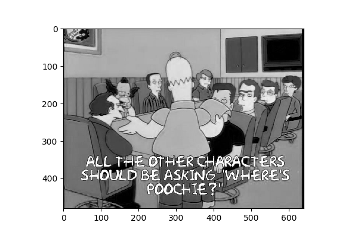
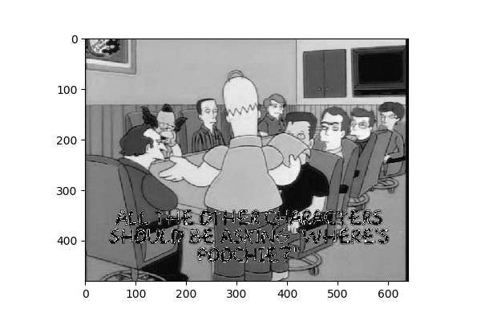
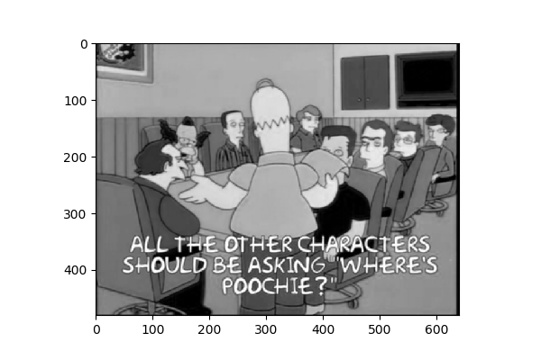
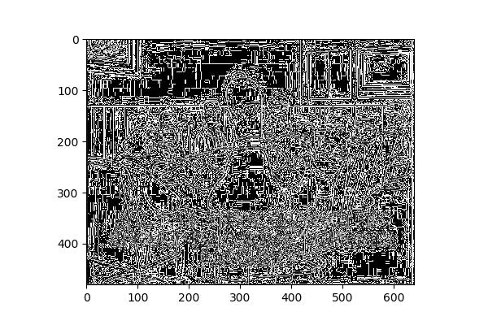

# Computing in Astronomy<!-- .element: class="centered" -->
### Matthew Turk<!-- .element: class="righted" -->
### Spring 2018<!-- .element: class="righted" -->
### Lecture 8 <!-- .element: class="righted" -->

---

## More with Images

Today we'll start out with some basic image manipulation.

 * Histograms and shifting channels
 * Clipping
 * Build out our image class

---

## Review

We are able to define classes using the `class` keyword.  These can have data
and functions associated with them.

```python
class Door:
    def __init__(self, locked = False):
        self.locked = locked
        self.open = False

    def open(self):
        if self.open:
            return True
        elif self.locked:
            return False
        else:
            self.open = True
            return True
```

We create *instances* of these classes by calling them:

```python
my_door = Door()
```

---

## Review

We can use Pillow to read in image data and turn it into an array:

```python
from PIL import Image
import numpy as np

my_image = Image.open("wherespoochie.jpg")
im_arr = np.array(my_image)
```

---

## Review

We can display an image, although not at explicitly its native size, using
matplotlib:

```python
import matplotlib.pyplot as plt
plt.imshow(im_arr)
```

Note a handful of things:

 * If this had one channel, it would apply a colormap
 * Image y-origins are natively at the top, not the bottom.

---

## Review

We can make histograms of the three channels:

```python
plt.hist(im_arr[:,:,0].ravel(), bins=256, color='r', alpha=0.33);
plt.hist(im_arr[:,:,1].ravel(), bins=256, color='g', alpha=0.33);
plt.hist(im_arr[:,:,2].ravel(), bins=256, color='b', alpha=0.33);
```

---

## Today

 * Image data representation
 * Shifting colors
 * Clipping
 * Convolving

---

## Image Data Representation

There are several mechanisms for representing image data; for our purposes, we
will focus on two primary mechanisms:

 * 8-bit RGBA data
 * Floating point data (one or more channels)

There are numerous ways to store these types of data on disk.  We will largely
be thinking of the first set as coming from image files (although image files
may also contain different bitsizes, channel selections and so on.)

For the second, our data can come in many different formats.  FITS files, HDF5,
even raw numpy arrays that we hand-craft ourselves in small batches.

---

## Problems with Integer Images

What happens if we add 1 to a `uint8` value of 255?

```python
np.uint8(255) + 1

np.ones(10, dtype='uint8') * 255 + 1
```

(Why are these different results?)

---

## Shift Image Values



Using the red channel of our `wherespoochie.jpg` image, we can plot this in
gray scale.  What happens if we add a value of 10 to this?

```python
plt.imshow(im_array[:,:,0] + 10, cmap = 'gray')
```

---

## Shift Image Values



Everywhere that was above 246 has *wrapped around* to low values.

What are some ways we can get around this?

---

## Getting Around Wraparound

We can clip an array using `np.clip` and supplying a minimum and a maximum:

The simplest way here is to upcast to a higher bitsize, then clip and downcast after.

```python
temp = im_array.astype("uint16") + 10
temp = np.clip(temp, 0, 255)
temp = temp.astype("uint8")
```

We may not always be able to do this, so instead, we pre-clip our values before
adding to them.

```python
np.clip(im_array, 0, 246)
```

If we know we are adding a value of X, we can compute our clipping bounds in
advance as well:

```python
input_array = np.clip(im_array, 0 - X, 255 - X)
```

---

## Scaling Our Values

For scaling, it may be better to operate in floating point values.  We can
remap from `0..255` to `0..1` in floating point values:

```python
im_fp = im_array.astype("float64") / 255
```

We can scale back either by clipping or by re-normalizing:

```python
fp_u8_clip = (im_fp * 255), 0, 255).astype("uint8")
fp_u8_scale = (im_fp - im_fp.min())/(im_fp.max() - im_fp.min())
fp_u8_scale = (fp_u8_scale * 255).astype("uint8")
```

---

## Image Filtering

We can apply a filtering matrix to convolve the image.  Let's explore a few of
these.

---

## Filtering: Identity 


$\begin{bmatrix} 0 & 0 & 0 \\\ 0 & 1 & 0 \\\ 0 & 0 & 0 \end{bmatrix} $
<!-- .element: style="text-align: center;" -->

---

## Filtering: Average



$\frac{1}{9} \begin{bmatrix} 1 & 1 & 1 \\\ 1 & 1 & 1 \\\ 1 & 1 & 1 \end{bmatrix} $
<!-- .element: style="text-align: center;" -->

---

## Filtering: Highpass



$ \begin{bmatrix} 0 & -1 & 0 \\\ -1 & 4 & -1 \\\ 0 & -1 & 0 \end{bmatrix} $
<!-- .element: style="text-align: center;" -->

---

## Put It All Together

We will now augment our image class to implement these operations:

 * Plot unified image and histogram
 * Shift color values
 * Re-scale
 * Add images
 * Convolve images

---
